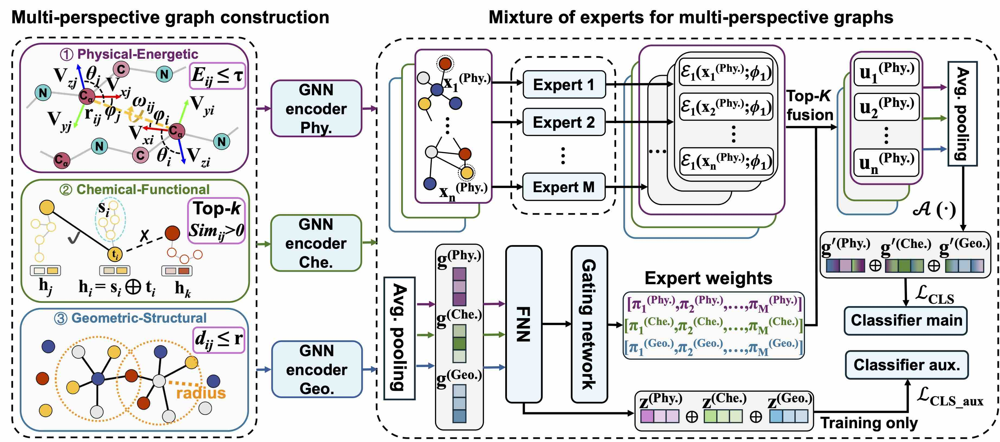

# MMPG
This is the official implementation for AAAI26 paper ["MMPG: MoE-based Adaptive Multi-Perspective Graph Fusion for Protein Representation Learning"](https://ojs.aaai.org/index.php/AAAI/article/view/37096)/[(arXiv version)](https://arxiv.org/abs/2601.10157).

## Overview

Graph Neural Networks (GNNs) have been widely adopted for Protein Representation Learning (PRL), as residue interaction networks can be naturally represented as graphs.
Current GNN-based PRL methods typically rely on single-perspective graph construction strategies, which capture partial properties of residue interactions, resulting in incomplete protein representations.

To address this limitation, we propose MMPG, a framework that **constructs protein graphs from multiple perspectives and adaptively fuses them via Mixture of Experts (MoE)** for PRL.
MMPG constructs graphs from **physical, chemical, and geometric perspectives** to characterize different properties of residue interactions. 
To capture both perspective-specific features and their synergies, we develop an MoE module, which dynamically routes perspectives to specialized experts, where experts learn intrinsic features and cross-perspective interactions. 
We quantitatively verify that MoE automatically specializes experts in **modeling distinct levels of interaction**—from individual representations, to pairwise inter-perspective synergies, and ultimately to a global consensus across all perspectives. 
Through integrating this multi-level information, MMPG produces superior protein representations and achieves advanced performance on four different downstream protein tasks.




## Dependencies

- Python 3.10.14
- bio==1.7.1
- torch-2.1.0+cu121
- Torch-geometric 2.6.0

## Dataset
We use four datasets, which can be found at:

https://github.com/DeepGraphLearning/torchdrug

https://github.com/divelab/DIG

To preprocess the data, please use the scripts from dataset fold.

Additionally, please use the scripts in `./preprocess_korp` to compute KORP pairwise potential, which is necessary for physical-energetic perspective.

## Usage

### Train the model

```
python train.py 
```

### Evaluate the model

The evaluation can be automatically implemented after training. You can also change the train.py to implement it individually.


## Citation

If you find our work useful, please consider citing it as follows:
```
@article{wang2026mmpg,
title={MMPG: MoE-based Adaptive Multi-Perspective Graph Fusion for Protein Representation Learning},
volume={40},
url={https://ojs.aaai.org/index.php/AAAI/article/view/37096},
DOI={10.1609/aaai.v40i2.37096},
journal={Proceedings of the AAAI Conference on Artificial Intelligence},
author={Wang, Yusong and Shen, Jialun and Wu, Zhihao and Xu, Yicheng and Tan, Shiyin and Xu, Mingkun and Wang, Changshuo and Song, Zixing and Tiwari, Prayag},
year={2026},
month={Mar.},
pages={1240-1248}
}
```

